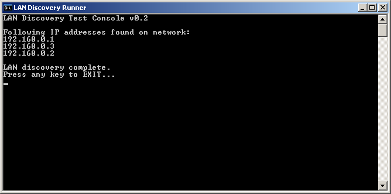

LANMachines
===========

Library to find all machines on your local network.
Machines have to be pingable.

Asynchronous pinging is carried out to get a list of machines quickly.
The ARP command is then used and any machines found in this way are added to the list if they don't exist there already.

Performance isn't too bad (subjective) but would be happy to hear of any suggestions for improvement.

Usage
-----

```c#
LanDiscoveryManager lanDiscovery = new LanDiscoveryManager();
List<IPAddress> lanMachines = lanDiscovery.GetNetworkMachines();
```
Example Output
--------------

Example output running in a console



For a full usage example, please see [this file](https://github.com/RedSpiderMkV/LANMachines/blob/master/src/LANMachines/LanMachinesRunner/Program.cs)

[Based on this nice and useful stackoverflow post](http://stackoverflow.com/questions/4042789/how-to-get-ip-of-all-hosts-in-lan)
